# designer

《贯穿设计模式》学习笔记

持续更新!

## 博客

欢迎学习我的博客-https://blog.csdn.net/qq_41124175/category_10663389.html

### 适配器模式
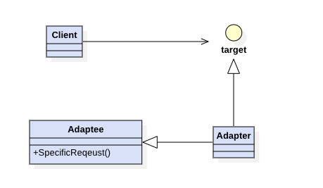

### 桥接模式
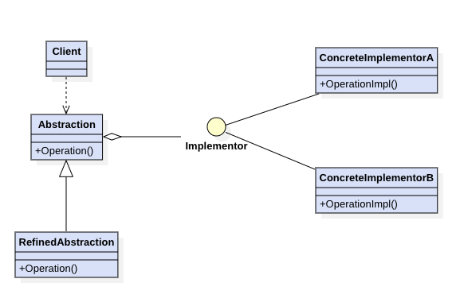

### 组合模式
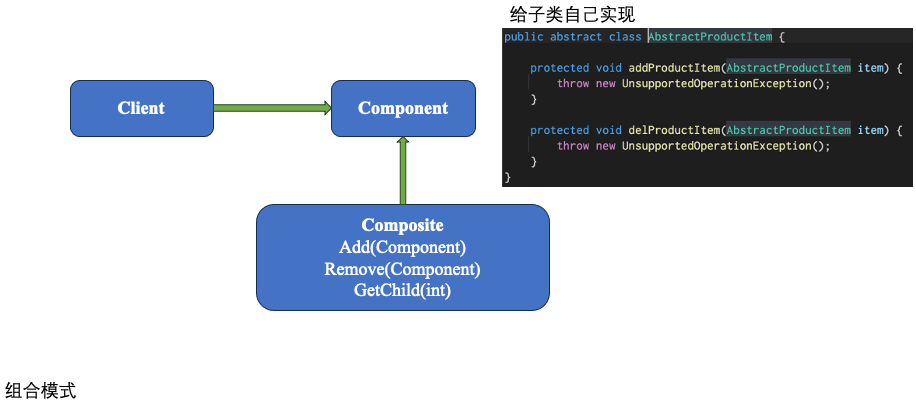

### 访问者模式
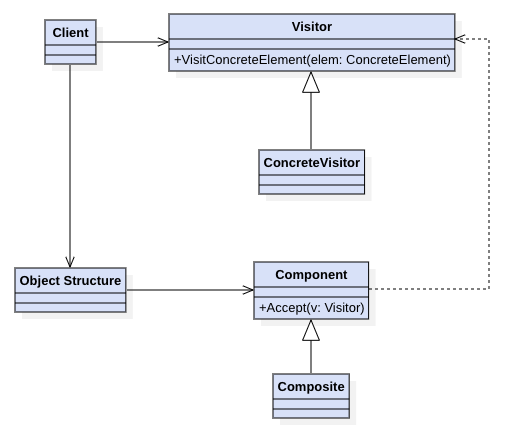

### 状态模式-有状态
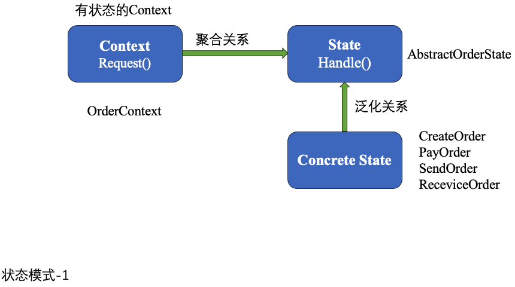

### 状态模式-无状态
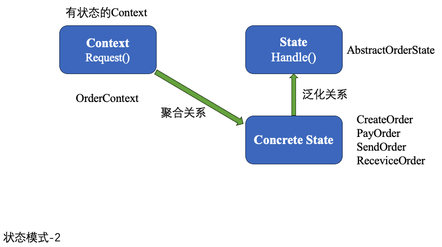

### 观察者模式
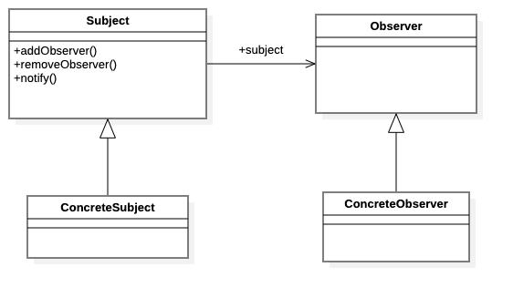

### 门面模式
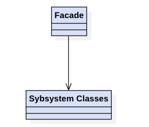

### 策略模式
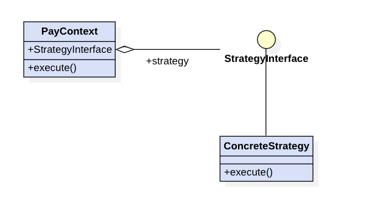

### 工厂模式
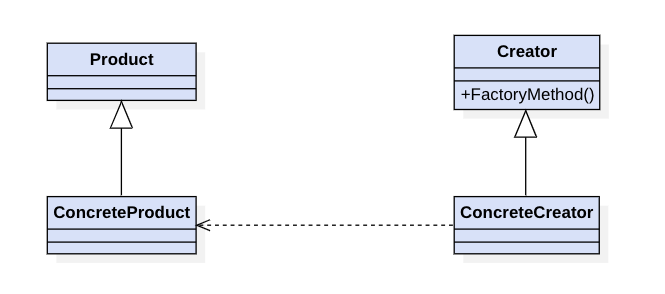

### 享元模式
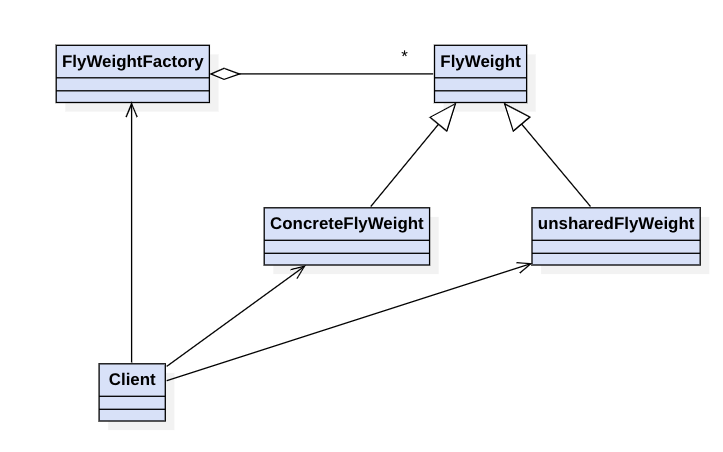

unsharedFlyWeight: 不可共享的对象（即每次使用都需要使用关键字new出来）

### 责任链模式
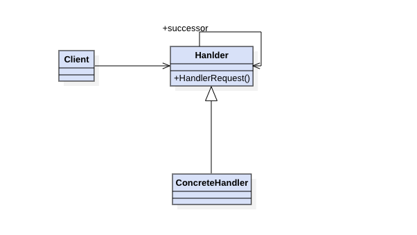 

叫责任链表比较合适

#### 需求

实时地，根据city，sex，product字段进行业务投放，比如：北京的男生；四川的电脑等等 → 责任链模式（责任链表模式）

### 装饰器模式

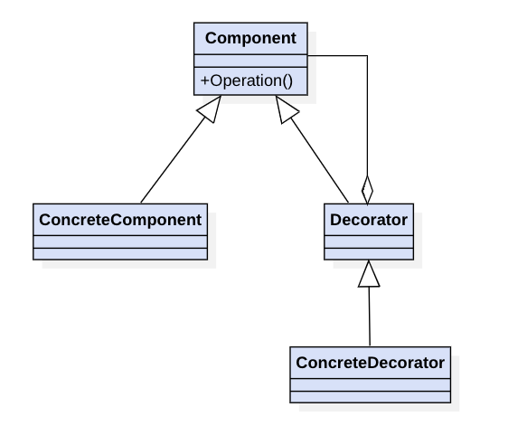

旨在不改变一个对象逻辑的前提下，为这个对象添加其他额外的职责, Decorator,组合Component又实现Component
