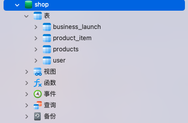
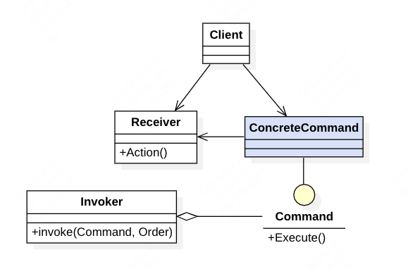

# designer

《贯穿设计模式》学习笔记，持续更新! :wink:

## 总览

```
./designer
├── adapter#适配器模式
├── bridge#桥接模式
├── builder#建造者模式
├── command#命令模式
├── composite#组合模式
├── decorator#装饰者模式
├── dutyChain#责任链表模式
├── facade#门面模式
├── factory#工厂模式
├── listener#观察者模式
├── mediator#中介者模式
├── proxy#代理模式
├── state#状态模式
├── strategy#策略模式
└── template#模版模式
```

## 博客

欢迎学习我的博客-https://juejin.cn/column/7348320601998295079 :v:

## 环境准备

### 数据导入

创建数据库 shop, 并导入 resources/sql/\*.sql 文件

使用 navicat 可视化可得



### 执行 docker

### 部署 Apollo(责任链模式)

```
cd Apollo && docker-compose up -d
```

### 部署 rabbitMQ(命令模式)

```shell
docker run -d --hostname my-rabbit --name rabbit -p 15672:15672 -p 5673:5672 rabbitmq # 启动容器

docker exec -it rabbit /bin/bash # 进入容器

rabbitmq-plugins enable rabbitmq_management # 开启rabbitmq_management
```

## 设计模式 UML 图汇总

### 适配器模式


> 需求

已有用户登陆功能，新增加第三方登陆方式

> 目标

将一个接口转变为另一个接口，适配类和原有类具有相同的接口，并且持有新的目标对象

### 桥接模式


> 需求

已有用户登陆功能，新增加第三方登陆方式

> 目标

将抽象和实现进行了分离，后期扩展性很高(有轻微的类膨胀)

### 组合模式


> 需求

商品的类目数量越来越多，类目层级越来越深，业务部门要求修改完商品类目 2 个小时内生效

> 方案

1. 组合模式
2. 采用先更新数据库，再更新缓存，前端缓存时间设置为 2 个小时的策略

> 目标

旨在将对象组合成树形结构以表示"部分-整体"

### 访问者模式


> 解释

Object Structure: 数据提供者籍商品类目的提供者

1. client 先通过 ObjectStructure 获取树形商品类目数据
2. 调用 visitor 对步骤 1 的树形数据进行访问

> 需求

操作上述商品类目

> 目标

旨在操作某个对象结构中各个层级元素的模式，在不改变元素整体结构的前提下，定义作用于这些元素的新操作

### 状态模式-有状态


Context 组合的是 State 还是 ConcreteState 决定状态模式是否是有状态的

1. 有状态：只能处理一个订单
2. 无状态：解决上述问题

> 需求

订单状态存在待支付，待发货，待收获，订单完成。如何实现订单状态的流转

> 目标

旨在封装状态的内部变更，类的行为基于状态的变化而变化，不同的状态，有不同的操作行为

### 状态模式-无状态


> 补充

状态模式一般在企业开发中使用较少，单独开发成本和复杂度较高，一般使用 spring 的 statemachine 来表现有限状态机

### 观察者模式


> 需求

需求同上

> 目标

也被称为发布-订阅模式，能够展现从事件的发生到事件的发送，再到事件的接受处理的整个过程

> 解释

Subject 是被观察者用于通知观察者的方法

### 命令模式



> 需求

需求同上

> 目标

通过将请求封装到一个命令对象中，实现了请求调用者和具体实现者之间的解耦

> 解释

Receiver: 真正执行命令的对象。接受者可以有多个，主要根据业务需求而定
Invoke: 接受客户端正确的指令,并触发命令的执行

### 门面模式


Spring-Cloud GateWay 就是一个门面，提供所有请求访问的入口

### 策略模式


> 需求

支付存在着支付宝支付，微信支付等等

> 目标

对象有某个行为，在不同的场景中，该行为有不同的实现逻辑

### 工厂模式


### 享元模式


> 解释

unsharedFlyWeight: 不可共享的对象（即每次使用都需要使用关键字 new 出来）

### 责任链模式


叫责任链表比较合适

> 需求

实时地，根据 city，sex，product 字段进行业务投放，比如：北京的男生；四川的电脑等等 → 责任链模式（责任链表模式）

### 装饰器模式


> 目标

旨在不改变一个对象逻辑的前提下，为这个对象添加其他额外的职责, Decorator,组合 Component 又实现 Component

> 需求

- 在业务投放的同时，需要给用户发放红包或者积分，在不改动的投放逻辑的前提下，增加一条异步的链路 → 装饰者模式
- 新增加的异步链路对支付主链路来说是弱依赖的，在业务高峰期可以将其功能下掉或 30 分钟之后再进行同步。
- 功能正常/下掉/30 分钟之后再同步 → Apollo 配置选项提供 feature 开关
- 30 分钟同步 → 引入 MQ 死信队列来解决

解决死信队列方案如下:


原理：NormalMQ Queue 中没有配置消费者，发送消息设置了 30 分钟的最大消费时间，如果 30 分钟内没有被正常消费则转移到死信队列里再进行消费。

### 建造者模式


将不同的组件进行组装，最终生成一个最终的对象。与工厂模式的区别：

- 工厂模式和建造者模式都是为了建造对象；
- 工厂模式重在结果，只要能够建造对象即可；建造者模式重在构件过程，需要关心如何将不同的信息组装成一个完整的对象;

### 原型模式


在 Java 语言中，比较简单，常用的两个方法如下：

- 实现 Cloneable 接口重写 clone 方法即可
- 实现 Serializable 序列化

需要区分一下引用拷贝，浅拷贝，深拷贝的区别。

### 代理模式


一般来对现有方法的增强。 上述是静态代理的 UML 图，在实战中也需要注意掌握 JDK 和 CGLIB 动态代理的原理和适用场景。

### 中介者模式


中介者模式可以通过中介者来封装一系列的对象交互，将对象间复杂的关系网状结构变成结构简单的以中介者为核心的星形结构，从而简化对象间的关系。

- Mediator：代表着中介者
- Colleague：代表着同事类（本例为购买者和支付者）

Colleague 的所有操作都是对中介者的操作，所以有 Colleague 指向 Mediator 的箭头；
ConcreteMediator 也持有了 ConcreteColleagueA（购买者）和 ConcreteColleagueB（支付者）的引用。

### 模版模式


主要是 AbstractClass 对模版方法进行定义，ConcreteClass1-n 是子类实现父类特有的方法。
